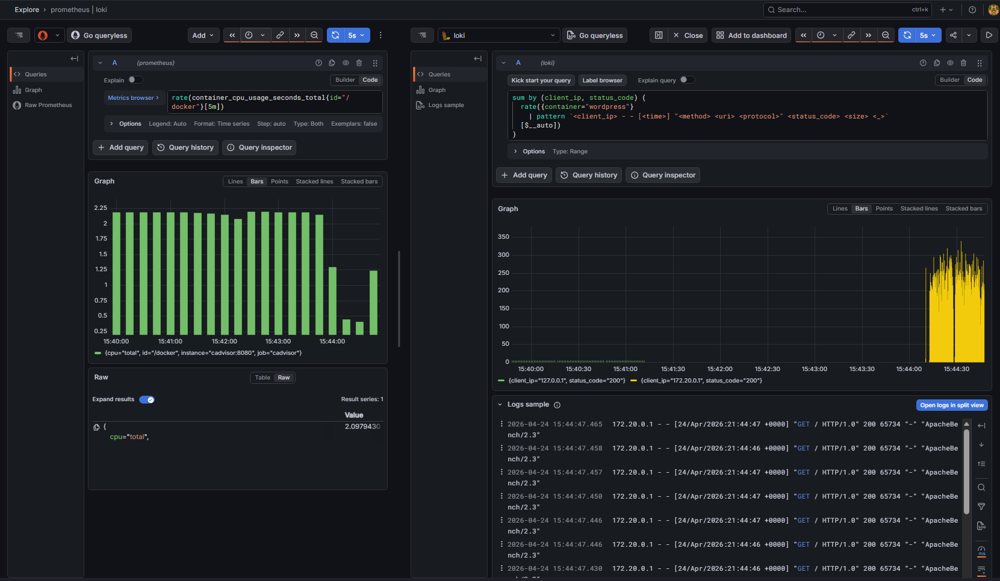

# Phase 4 — Performance Analysis & Diagnostic Methodology

> Formalize the diagnostic process into a repeatable SOC playbook. Execute synthetic load testing against WordPress to generate telemetry, and document the exact PromQL and LogQL query pairs used for incident response.

---

## 1. Objective

Transition the observability stack from a passive data collection mechanism into an active incident response tool. This phase simulates real-world stress on the target application to generate anomalous telemetry, establishing a baseline for how the system behaves under pressure. 

By the end of this phase:
- A synthetic load generator is used to stress test the WordPress application.
- The tacit knowledge from Phase 3 is codified into a structured 3-Step Diagnostic Methodology, validated by actual benchmark data.
- A repeatable SOC Incident Response Playbook is documented with specific PromQL/LogQL query pairs for common threat scenarios.

---

## 2. Synthetic Load Generation (Stress Testing) & Results

To visualize an attack or high-traffic event, we must generate synthetic load against the WordPress container. Rather than installing local tools, we leverage an ephemeral Docker container running `ab` (Apache HTTP server benchmarking tool) to flood the application with requests.

The following command was executed from the host machine to simulate 10,000 requests with 100 concurrent connections:

```bash
docker run --rm --network host jordi/ab -n 10000 -c 100 http://localhost:8080/
```

### Benchmark Results Analysis
The stack successfully processed the load test, demonstrating significant resilience while clearly highlighting the symptoms of resource contention. The `ab` output yielded the following intelligence:

* **Reliability:** Out of 10,000 requests, there were **0 failed requests**. The WordPress and MySQL containers absorbed the total traffic volume without dropping connections or returning 5xx gateway errors.
* **Throughput:** The server processed an average of 238.80 requests per second.
* **Resource Contention:** While the system remained online, latency metrics revealed underlying compute saturation. The median response time was a stable 411ms, but the longest request spiked to **19,235ms (19.2 seconds)**. This long tail indicates severe resource starvation at peak load, serving as our primary Indicator of Compromise (IoC) for the telemetry.



---

## 3. The 3-Step Diagnostic Methodology

When an alert fires or an anomaly is spotted on the Grafana dashboard, analysts should follow this strict, chronological workflow to minimize Mean Time to Resolution (MTTR). This methodology was successfully validated against the `ab` synthetic load test.

### Step 1: Metric Anomaly Detection (The "What" and "When")
* **Action:** Identify the deviation from the baseline on the Grafana dashboard.
* **Observation:** During the synthetic test, Prometheus recorded the Docker Engine (`id="/docker"`) CPU utilization spiking to approximately **2.1 cores** for a sustained period of several minutes.
* **Output:** The exact timestamp of the CPU anomaly is isolated in Prometheus.

### Step 2: Time-Bound Log Correlation (The "Who" and "Where")
* **Action:** Open the Grafana **Explore** tab and set the time picker to match the exact anomaly window identified in Step 1.
* **Observation:** Querying Loki for the `wordpress` container revealed a massive, dense cluster of logs occurring in the exact same time window as the CPU spike.
* **Output:** The specific log streams tied to the resource starvation event are isolated.

### Step 3: Root Cause Isolation (The "Why")
* **Action:** Apply LogQL pipeline filters to extract actionable intelligence (IP addresses, specific error codes).
* **Observation:** Using the pattern parser, Loki revealed an overwhelming flood of HTTP `200` OK responses originating from `172.20.0.1` (the Docker bridge gateway IP, routing the host's `ab` traffic). 
* **Output:** Threat identified. The data proves the CPU exhaustion was caused by a volumetric traffic flood actively being processed by the server, rather than an internal application crash or deadlock.

---

## 4. SOC Incident Response Playbook

Below is the query arsenal mapped to specific incident scenarios, explicitly designed around the WSL2 virtualization constraints identified in Phase 2.

### Scenario A: Volumetric Attack (DDoS / Brute Force)
**Symptom:** Grafana dashboard shows an unexpected vertical spike in Network Receive Bytes or CPU utilization.

**1. Isolate the Metric (PromQL):**
```promql
sum(rate(container_network_receive_bytes_total{id="/"}[1m]))
```
*Note: Using the root cgroup `id="/"` to capture all WSL2 virtual switch traffic.*

**2. Extract the Source (LogQL):**
Identify which IP addresses are generating the most traffic/errors in that exact minute.
```logql
sum by (client_ip, status_code) (
  rate({container="wordpress"} 
    | pattern `<client_ip> - - [<time>] "<method> <uri> <protocol>" <status_code> <size> <_>`
  [$__auto])
)
```

### Scenario B: Compute Saturation (Cryptojacking / CPU Exhaustion)
**Symptom:** Sustained CPU usage near 100% without a corresponding increase in legitimate web traffic.

**1. Isolate the Metric (PromQL):**
```promql
rate(container_cpu_usage_seconds_total{id="/docker"}[5m])
```

**2. Identify the Process Behavior (LogQL):**
Look for internal database errors or unexpected backend processes struggling under load.
```logql
{container=~"wordpress|mysql"} |= "error" |~ "(?i)(timeout|deadlock|exhausted)"
```

### Scenario C: Memory Leak / Out of Memory (OOM) Risk
**Symptom:** A slow, linear increase in memory consumption that never drops back to the baseline.

**1. Isolate the Metric (PromQL):**
```promql
container_memory_usage_bytes{id="/docker"}
```

**2. Check for OOM Kills (LogQL):**
Query the logs for explicit kernel-level or application-level out-of-memory terminations.
```logql
{container=~"wordpress|mysql"} |= "Out of memory"
```

---

## 5. Final Validation

By successfully executing the synthetic load and tracking it through the 3-Step Methodology, the stack proves its operational readiness. The integration of zero-instrumentation metrics with container-native logs provides absolute visibility into the WSL2 Docker environment.

### Verification checklist
- [x] Synthetic load successfully generated against `localhost:8080` resulting in 10,000 processed requests.
- [x] Prometheus captured the resulting compute saturation (2.1 cores) in real-time.
- [x] LogQL successfully parsed the resulting WordPress logs to identify the flood of HTTP `200` traffic.
- [x] The diagnostic methodology successfully links the specific PromQL CPU spike to its originating Loki log entries.

---

## Next Steps

With the diagnostic methodology formalized and proven under synthetic load, **Phase 5** will shift focus from active hunting to automated alerting. We will engineer `alert.rules.yml` for Prometheus to automatically detect the anomalies outlined in this playbook, and configure Notification Channels (such as Slack or Email webhooks) via Grafana to alert the SOC team proactively.